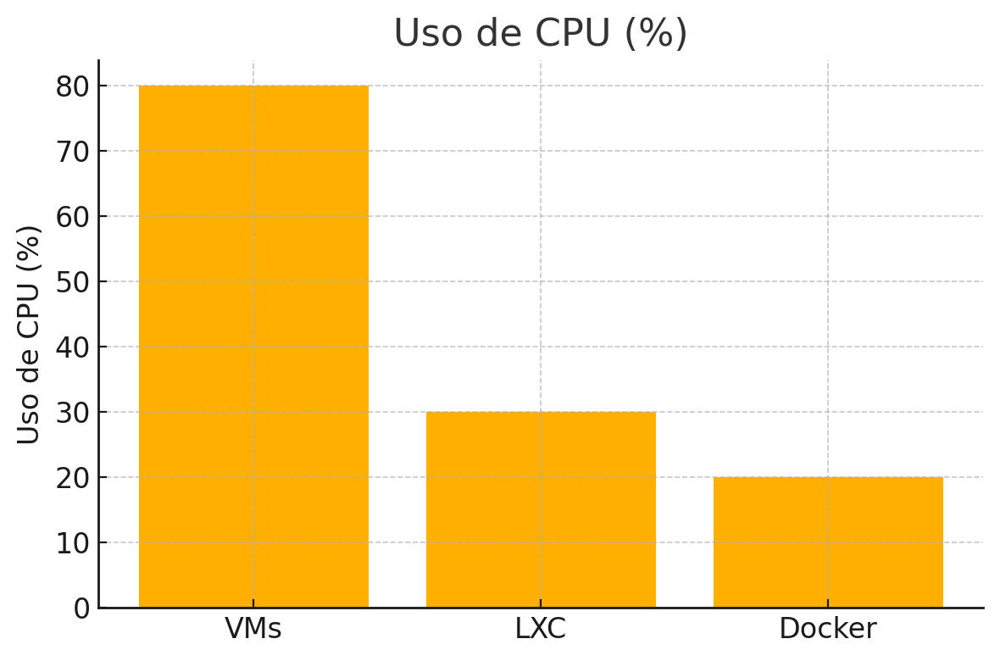
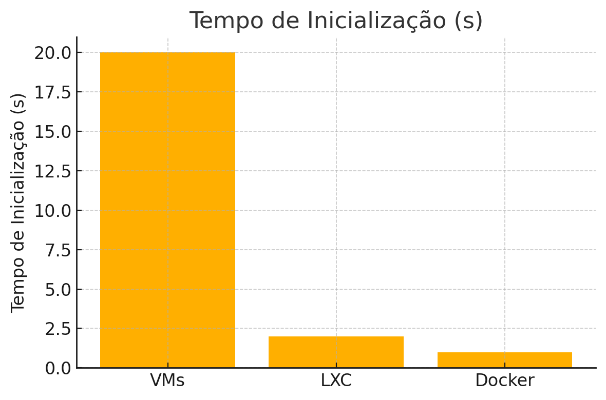
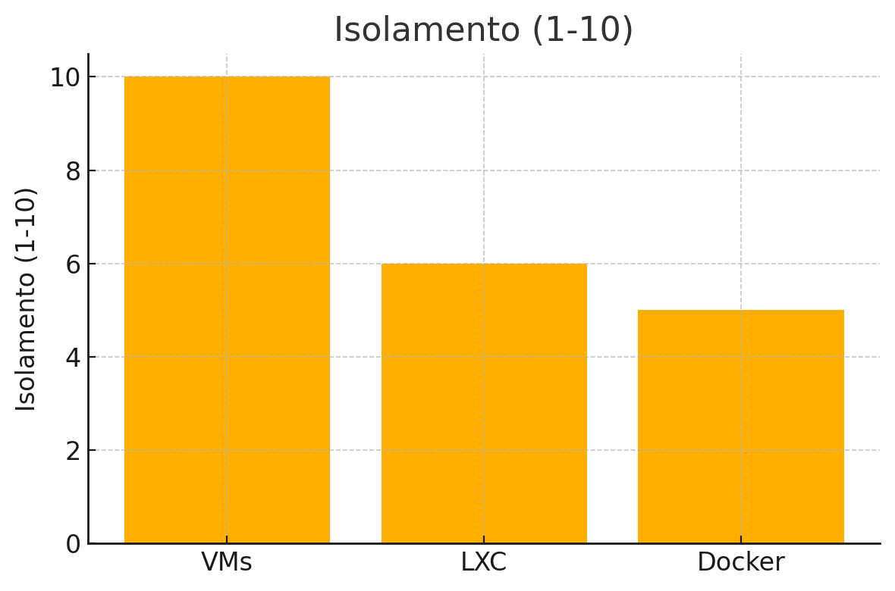

# 🧠 Comparativo: Máquinas Virtuais (VMs) vs Contêineres LXC vs Docker

Comparação entre as principais tecnologias de virtualização e conteinerização, com foco em desempenho, isolamento, uso de recursos e casos de uso.

---

## 🧩 Conceitos

### 🖥️ Máquinas Virtuais (VMs)
Simulam todo o hardware e rodam sistemas operacionais completos de forma isolada.

### 📦 Contêineres LXC
Ambientes Linux isolados que compartilham o kernel com o host. Mais leves que VMs.

### 🐳 Docker
Contêineres otimizados para aplicações e microserviços. Baseados em imagens e camadas.

---

## 📊 Gráficos comparativos

### Uso de CPU


### Uso de RAM


### Tempo de Inicialização


### Isolamento


---

## 🔍 Comparativo Técnico

| Característica             | VMs                       | LXC                          | Docker                       |
|---------------------------|---------------------------|------------------------------|------------------------------|
| Kernel                    | Próprio                   | Compartilhado                | Compartilhado                |
| Inicialização             | Lenta (~20s)              | Rápida (~2s)                 | Instantânea (~1s)            |
| Uso de recursos           | Alto                      | Baixo                        | Muito baixo                  |
| Isolamento                | Forte                     | Médio                        | Leve a médio                 |
| Portabilidade             | Moderada                  | Alta                         | Muito alta                   |
| Compatibilidade           | Windows/Linux/BSD         | Linux                        | Linux/macOS/Windows (via Docker Engine) |
| Casos de uso              | Virtualização completa    | Sistemas Linux leves         | Microserviços, DevOps        |

---

## ⚙️ Comandos no Proxmox

### Criar uma VM:
```bash
qm create 100 --name vm-ubuntu --memory 2048 --net0 virtio,bridge=vmbr0
qm importdisk 100 ubuntu22.qcow2 local-lvm
qm set 100 --scsihw virtio-scsi-pci --scsi0 local-lvm:vm-100-disk-0
qm set 100 --boot c --bootdisk scsi0
qm start 100
```

### Criar um container LXC:
```bash
pct create 101 local:vztmpl/debian-11-standard_11.6-1_amd64.tar.zst --hostname container-debian --cores 2 --memory 1024 --rootfs local-lvm:8 --net0 name=eth0,bridge=vmbr0,ip=dhcp --start 1
```

---

## ✅ Conclusão

- **VMs**: ideais para sistemas completos e múltiplos OS.
- **LXC**: leve, ideal para múltiplas instâncias Linux.
- **Docker**: melhor para aplicações portáveis e escaláveis.

---
